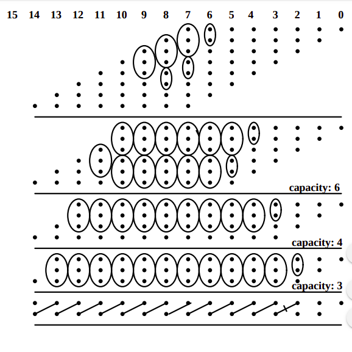

# 16x16-bit-Dadda-multiplication
Designing a Dadda multiplier for unsigned 16x16 bit multiplication with a Brent Kung adder for the final addition in synthesizable VHDL.

Dadda multiplier is a high speed, area efficient multiplier and is therefore of great importance in high speed applications and low power consumption.

Figure represents a 8x8 Multiplier, however, code is written for 16x16 Multiplier with 32 bit Brent Kung Adder

Goto [Documentation](https://github.com/sourabh-suri/16x16-bit-Dada-multiplication/blob/master/Documentation.pdf) for all details.....
